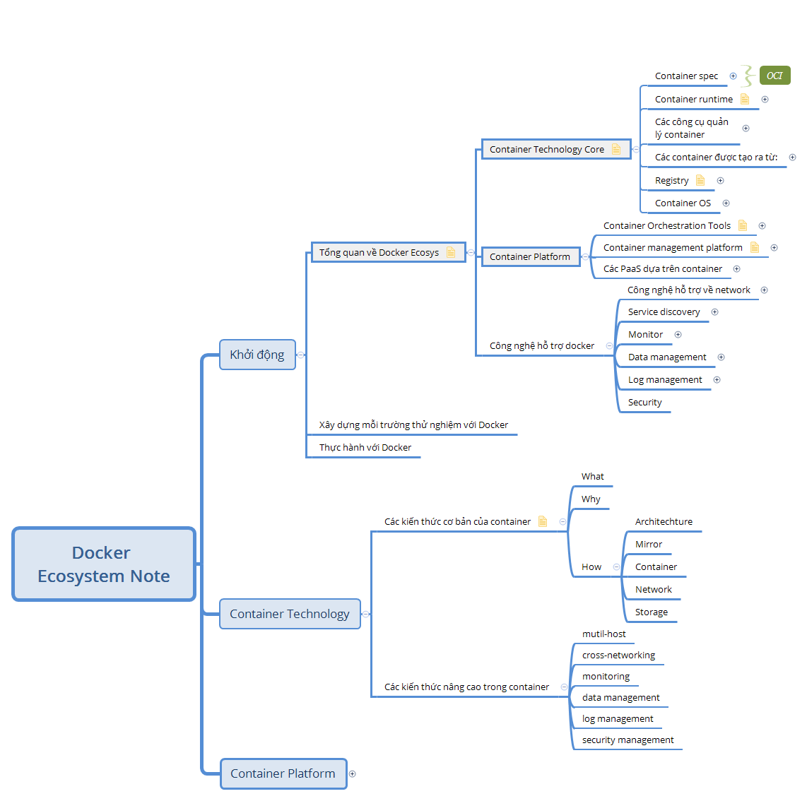
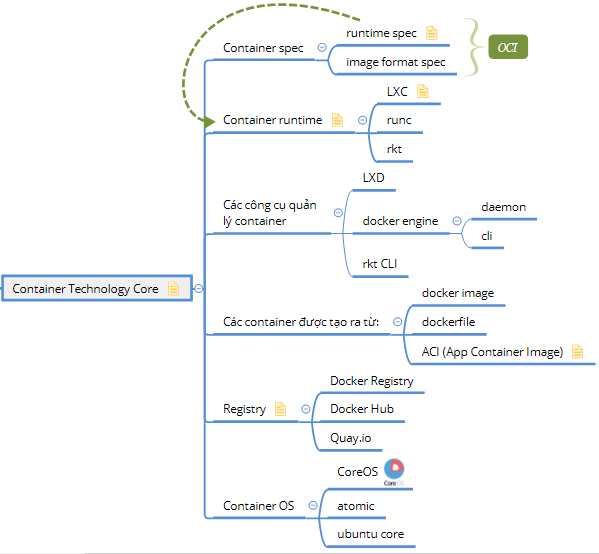
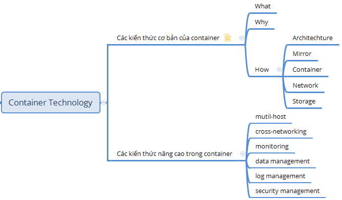
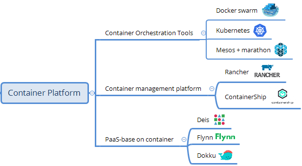
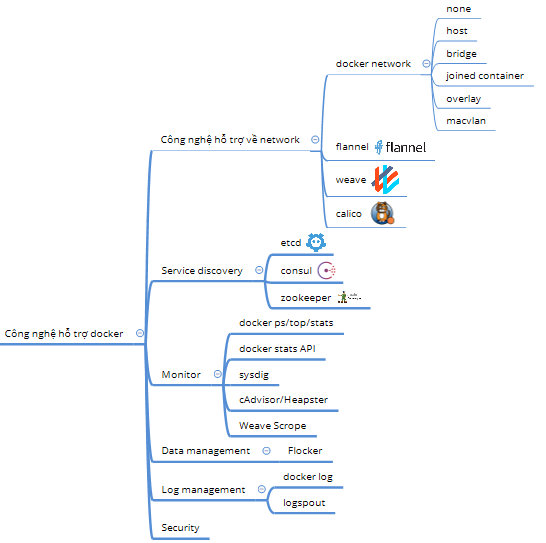

## Giới thiệu về hệ sinh thái của container

Container là một trong các xu hướng công nghệ rất phát triển trong vài năm trở lại đây. Container được áp dụng chủ yếu trong các môi trường như: phát triển phần mềm, thử nghiệm sản phẩm trước khi đưa ra thị trường và triển khai sản phẩm trong thực tế với quy mô lớn nhỏ khác nhau. Các hãng công nghệ lớn như google, IBM, Cisco, HP ... đều đầu tư về việc nghiên cứu hoặc áp dụng Container theo thế mạnh của từng hãng.

Chính sự phát triển nhanh chóng và tính ứng dụng cao của Container trong thực tế đã tạo nên một hệ sinh thái đặc sắc của Container ngày nay. Khi bắt đầu tìm hiểu về container và hệ sinh thái của nó, rất có thể bạn sẽ đi lạc vào các thuật ngữ công nghệ, các sản phẩm xung quanh Container. Do vậy, để tìm hiểu tốt về Container, bạn cần phải nắm bắt tổng quan về hệ sinh thái của Container.

Đọc kỹ phần này cũng sẽ giúp những người mới tiếp cận có cái nhìn sâu sắc hơn về container nói chung và từng thuật ngữ trong các tài liệu nói riêng. Khi đó bạn sẽ không bị bối rối bởi những khái niệm khác nhau như: 

- `Docker là gì?` 
- `Images (Mirror), Dockerfile có vai trò gì trong Docker?`
- `Docker Hub, Docker registry sử dụng để làm gì?`
- `Docker Machine, Docker Compose, Docker Swarm có vai trò gì trong Docker nói chung?`
- `Kubernetes là gì?`
- `Khi nào gọi là Container và khi nào thì gọi là Docker?`
- `Ngoài Docker thì còn có các thành phần nào khác không để triển khai container để áp dụng vào thực tế?`

Căn cứ vào quá trình tìm hiểu và tập hợp, chúng tôi xin tổng hợp về hệ sinh thái của Container theo từng phần lớn như sau: 

- Công nghệ lõi và kỹ thuật chính trong hệ sinh thái container.
- Các công nghệ nền tảng liên quan tới Container.
- Các công cụ hỗ trợ trong Docker

Khi đọc tới đây, bạn có thể bị lẫn giữa các từ ngữ như `Docker` và `Container`, để bạn có thể phân biệt 02 từ khóa này thì chỉ cần ghi nhớ: `Docker là một trong số các sản phẩm phần mềm để hiện thực hóa ý tưởng về công nghệ Container`. Hãy nhớ nhé ;) 

### Công nghệ lõi và kỹ thuật chính trong hệ sinh thái container

Trong phần này, chúng ta sẽ đề cập về các khái niệm chính (công nghệ chính)  mà Container sử dụng, mối liên quan giữa các công nghệ này, các sản phẩm phần mềm trong container. Phần này trong tài liệu mà bạn đang đọc thì chỉ dừng lại ở mức liệt kê và giúp bạn có thông tin ngắn gọn nhất. 

Một trong các sản phẩm để hiện thực hóa ý tưởng container là Docker sẽ được đề cập chính trong tài liệu này.

Khi tìm hiểu về docker cơ bản, chúng ta sẽ phân loại thành: `Các kiến thức cơ bản trong Docker` và `Các kiến thức nâng cao trong Docker`

### Các công nghệ nền tảng liên quan tới Container

Phần này sẽ giới về các nền tảng (Platform) trong hệ sinh thái trong Container, các nền tảng này có ý nghĩa và vai trò như thế nào đối với từng đối tượng người sử dụng. Phần này sẽ cung cấp các thông tin về `Container Orchestration Tools` là gì, `Container management platform` là gì và để làm gì, `PaaS-base on container` là gì.
 

### Các công cụ hỗ trợ trong Docker

Phần này sẽ liệt kê các công cụ hỗ trợ của Docker theo từng lĩnh vực đã phân chia theo hình ảnh dưới.

