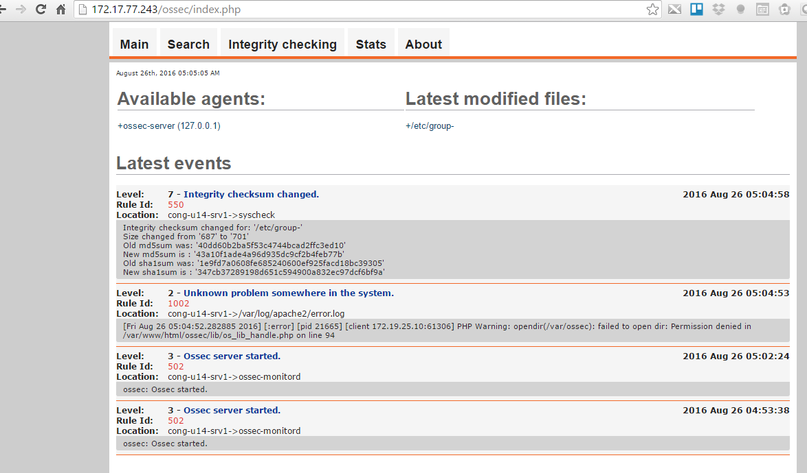

# Ghi chép về OSSEC

# Mô hình standalone
## Môi trường thực hiện

- Ubuntu 14.04 64 bit
- ossec-hids-2.8.3.tar.gz

##  Update OS  và cài đặt gói bổ trợ

- Update OS 

    ```sh
    apt-get update -y 
    ```

- Cài đặt gói bổ trợ

    ```sh
    apt-get -y install build-essential make libssl-dev git unzip
    
    apt-get -y install mysql-server libmysqlclient-dev mysql-client \
        apache2 php5 libapache2-mod-php5 php5-mysql php5-curl php5-gd \
        php5-intl php-pear php5-imagick php5-imap php5-mcrypt php5-memcache \
        php5-ming php5-ps php5-pspell php5-recode php5-snmp php5-sqlite php5-tidy php5-xmlrpc php5-xsl
    ```
    
    - Trong quá trình cài cần nhập mật khẩu cho `MySQL`, trong hướng dẫn này tôi sử dụng mật khẩu là `PTCC@!2o015`

## Cài đăt OSSEC

### Cài từ repos

    ```sh
    apt-key adv --fetch-keys http://ossec.wazuh.com/repos/apt/conf/ossec-key.gpg.key
    echo "deb http://ossec.wazuh.com/repos/apt/ubuntu trusty main" >> /etc/apt/sources.list
    apt-get update

    apt-get install ossec-hids
    apt-get install ossec-hids-agent
    ```

### Cài từ gói

- Tải gói cài đặt

    ```sh
    wget https://bintray.com/artifact/download/ossec/ossec-hids/ossec-hids-2.8.3.tar.gz
    ```

- Giải nén

    ```sh
    tar -zxf ossec-hids-2.8.3.tar.gz
    ```
- Thực hiện cài đặt

    ```sh
    cd ossec-hids-2.8.1
    ```

### Draf

- Cai postfix-as-a-send-only-smtp-server-on-ubuntu-14-04

 - https://www.digitalocean.com/community/tutorials/how-to-install-and-configure-postfix-as-a-send-only-smtp-server-on-ubuntu-14-04
 
- Lệnh test ssh

```sh
hydra -t 128 -l user_name -V -x '4:4:aA1"@#$!()=`~?><;:%^&*_-+/,.\ ' 172.16.69.230 ssh
``` 

# Các bước cài với mô hình Client Server
## Trên Server
### Cài `OSSEC`

- Update OS 

    ```sh
    apt-get update -y 
    ```
    
- Tải các gói bổ trợ

    ```sh
    apt-get -y install build-essential make libssl-dev git unzip
    ```

    ```sh
    apt-get -y install mysql-server libmysqlclient-dev mysql-client \
        apache2 php5 libapache2-mod-php5 php5-mysql php5-curl php5-gd \
        php5-intl php-pear php5-imagick php5-imap php5-mcrypt php5-memcache \
        php5-ming php5-ps php5-pspell php5-recode php5-snmp php5-sqlite php5-tidy php5-xmlrpc php5-xsl
    ```

    - Trong quá trình cài cần nhập mật khẩu cho `MySQL`, trong hướng dẫn này tôi sử dụng mật khẩu là `PTCC@!2o015`

- Tải và giải nén `OSSEC`

    ```sh    
    wget https://bintray.com/artifact/download/ossec/ossec-hids/ossec-hids-2.8.3.tar.gz
    tar -xzf ossec-hids-2.8.3.tar.gz
    cd ossec-hids-2.8.3
    ```
- Kích hoạt để `OSSEC` sử dụng DB MySQL, mặc định sẽ không có DB Postgresql, bỏ qua màn hình thông báo về Postgresql

    ```sh
    cd src
    make setdb
    ```

- Cài đặt `OSSEC`

    ```sh
    cd  ../
    ./install.sh
    ```
    
- Lựa chọn các tùy chọn sau

    - Chọn: en
    
        ```sh
        root@OSSEC-Server:~/ossec-hids-2.8.3# ./install.sh

          ** Para instalação em português, escolha [br].
          ** 要使用中文进行安装, 请选择 [cn].
          ** Fur eine deutsche Installation wohlen Sie [de].
          ** Για εγκατάσταση στα Ελληνικά, επιλέξτε [el].
          ** For installation in English, choose [en].
          ** Para instalar en Español , eliga [es].
          ** Pour une installation en français, choisissez [fr]
          ** A Magyar nyelvű telepítéshez válassza [hu].
          ** Per l'installazione in Italiano, scegli [it].
          ** 日本語でインストールします．選択して下さい．[jp].
          ** Voor installatie in het Nederlands, kies [nl].
          ** Aby instalować w języku Polskim, wybierz [pl].
          ** Для инструкций по установке на русском ,введите [ru].
          ** Za instalaciju na srpskom, izaberi [sr].
          ** Türkçe kurulum için seçin [tr].
          (en/br/cn/de/el/es/fr/hu/it/jp/nl/pl/ru/sr/tr) [en]: en
        ```
        
    - Ấn `Enter`
    
        ```sh
        OSSEC HIDS v2.8.3 Installation Script - http://www.ossec.net

        You are about to start the installation process of the OSSEC HIDS.
        You must have a C compiler pre-installed in your system.
        If you have any questions or comments, please send an e-mail
        to dcid@ossec.net (or daniel.cid@gmail.com).

        - System: Linux OSSEC-Server 3.19.0-66-generic
        - User: root
        - Host: OSSEC-Server


        -- Press ENTER to continue or Ctrl-C to abort. --
        ```

    - Chọn: `server`
    
        ```sh
        1- What kind of installation do you want (server, agent, local, hybrid or help)? server
        ```
    
    - Ấn `Enter` (để mặc định)
    
        ```sh
        2- Setting up the installation environment.

        - Choose where to install the OSSEC HIDS [/var/ossec]:
        ```
    
    - Chọn `y`
    
        ```sh
        3- Configuring the OSSEC HIDS.

            3.1- Do you want e-mail notification? (y/n) [y]:
        ```
    
    - Nhập email để ossec gửi thông báo tới
    
        ```sh
        3.1- Do you want e-mail notification? (y/n) [y]: y
            - What's your e-mail address? tcvn1985@gmail.com
        ```
    
    - Chọn `n` và gõ `localhost` (sử dụng chính máy này gửi mail đi)
    
        ```sh
        - We found your SMTP server as: alt3.gmail-smtp-in.l.google.com.
        - Do you want to use it? (y/n) [y]: n

        - What's your SMTP server ip/host? localhost
        ```
    
    - Chọn `y`
    
        ```sh
        3.2- Do you want to run the integrity check daemon? (y/n) [y]: y
        ```
    
    - Chọn `y`
    
        ```sh
        3.3- Do you want to run the rootkit detection engine? (y/n) [y]: y
        ```
   
    - Chọn `y`

        ```sh
        3.4- Active response allows you to execute a specific
               command based on the events received. For example,
               you can block an IP address or disable access for
               a specific user.
               More information at:
               http://www.ossec.net/en/manual.html#active-response

           - Do you want to enable active response? (y/n) [y]:
        ```
    
    - Chọn `y`
    
        ```sh
        - Do you want to enable the firewall-drop response? (y/n) [y]: y
        ```
        
    - Chọn `y` để khai báo thêm IP vào danh sách IP white list
    
        ```sh
        - Do you want to add more IPs to the white list? (y/n)? [n]: y
           - IPs (space separated): 172.16.69.1
        ```
        
    - Chọn `y`
    
        ```sh
        3.5- Do you want to enable remote syslog (port 514 udp)? (y/n) [y]: y
        ```
    
    - Chọn `ENTER`
    
        ```sh
        3.6- Setting the configuration to analyze the following logs:
            -- /var/log/auth.log
            -- /var/log/syslog
            -- /var/log/dpkg.log
            -- /var/log/apache2/error.log (apache log)
            -- /var/log/apache2/access.log (apache log)

         - If you want to monitor any other file, just change
           the ossec.conf and add a new localfile entry.
           Any questions about the configuration can be answered
           by visiting us online at http://www.ossec.net .


           --- Press ENTER to continue ---
        ```
        
- OSSEC bắt đầu được cài đặt
    
- Khởi động `ossec`

    ```sh
    /var/ossec/bin/ossec-control start
    ```
    
- Kiểm tra trạng thái của `ossec`

    ```sh
    /var/ossec/bin/ossec-control status
    ```
    
    - Kết quả
    
        ```sh
        root@OSSEC-Server:~# /var/ossec/bin/ossec-control status
        ossec-monitord is running...
        ossec-logcollector is running...
        ossec-remoted not running...
        ossec-syscheckd is running...
        ossec-analysisd is running...
        ossec-maild is running...
        ossec-execd is running...
        ```    

- Tạo DB cho `OSSEC`

    ```sh
    mysql -u'root' -p'PTCC@!2o015'
    create database ossec;
    grant all privileges on ossec.* to ossecuser@localhost identified by 'PTCC@!2o015';
    flush privileges;
    exit
    ```
    
- Tạo schema cho ossec (import các bảng cho database `ossec` vừa tạo ở trên)
    
    ```sh
    cd ossec-hids-2.8.3/
    mysql -u root -p ossec  < src/os_dbd/mysql.schema
    ```
    
    - Nhập mật khẩu cho tài khoản `root` của database

- Sao lưu file cấu hình của `ossec`

    ```sh
    cp /var/ossec/etc/ossec.conf /var/ossec/etc/ossec.conf.orig
    ```
    
- Khai bao trong `/var/ossec/etc/ossec.conf`, dòng khai báo này nằm trong cặp thẻ `<ossec_config>` và `</ossec_config>`. Thường chèn vào cuối file, trước thẻ `</ossec_config>`

    ```sh
    <ossec_config>
        <database_output>
            <hostname>127.0.0.1</hostname>
            <username>ossecuser</username>
            <password>PTCC@!2o015</password>
            <database>ossec</database>
            <type>mysql</type>
        </database_output>
    </ossec_config>
    ```

- Kích hoạt DB cho WEB 

    ```sh
    /var/ossec/bin/ossec-control enable database
    /var/ossec/bin/ossec-control restart 
    ```
    
### Cài đặt OSSEC WEB

- Tải  và cài đặt OSSEC WEB

    ```sh
    cd /var/www/html/
    wget https://github.com/ossec/ossec-wui/archive/master.zip
    unzip master.zip
    mv ossec-wui-master/ ossec/
    mkdir ossec/tmp/
    chown www-data: -R ossec/
    chmod 666 /var/www/html/ossec/tmp/
    usermod -a -G ossec www-data
    ```
    
- Sau khi cài đặt xong, truy cập vào web với link: `http://dia_chi_ip_may_chu/ossec`

    
    
## Cài đặt OSSEC Agent cho các Client

### Phía Client

- Cài đặt các gói bổ trợ

    ```sh
    apt-get -y install build-essential make libssl-dev git unzip
    ```
    
- Tải `OSSEC` và cài đặt

    ```sh    
    wget https://bintray.com/artifact/download/ossec/ossec-hids/ossec-hids-2.8.3.tar.gz
    tar -xzf ossec-hids-2.8.3.tar.gz
    cd ossec-hids-2.8.3
    ./install.sh 
    ```
    
- Khai báo các lựa chọn sau:

    - Lựa chọn ngôn ngữ: `en`
 
        ```sh
        root@OSSEC-Client:~/ossec-hids-2.8.3#     ./install.sh

        ** Para instalação em português, escolha [br].
        ** 要使用中文进行安装, 请选择 [cn].
        ** Fur eine deutsche Installation wohlen Sie [de].
        ** Για εγκατάσταση στα Ελληνικά, επιλέξτε [el].
        ** For installation in English, choose [en].
        ** Para instalar en Español , eliga [es].
        ** Pour une installation en français, choisissez [fr]
        ** A Magyar nyelvű telepítéshez válassza [hu].
        ** Per l'installazione in Italiano, scegli [it].
        ** 日本語でインストールします．選択して下さい．[jp].
        ** Voor installatie in het Nederlands, kies [nl].
        ** Aby instalować w języku Polskim, wybierz [pl].
        ** Для инструкций по установке на русском ,введите [ru].
        ** Za instalaciju na srpskom, izaberi [sr].
        ** Türkçe kurulum için seçin [tr].
        (en/br/cn/de/el/es/fr/hu/it/jp/nl/pl/ru/sr/tr) [en]:
        ```
        
    - Nhấn `ENTER` để tiếp tục
    
        ```sh
         You are about to start the installation process of the OSSEC HIDS.
         You must have a C compiler pre-installed in your system.
         If you have any questions or comments, please send an e-mail
         to dcid@ossec.net (or daniel.cid@gmail.com).

          - System: Linux OSSEC-Client 3.19.0-59-generic
          - User: root
          - Host: OSSEC-Client


          -- Press ENTER to continue or Ctrl-C to abort. --
        ```
            
    - Lựa chọn chế độ `agent`
    
        ```sh
        1- What kind of installation do you want (server, agent, local, hybrid or help)? agent
        ```

    - Nhấn `ENTER` để tiếp tục (khai báo đường dẫn cài đặt)

        ```sh
        2- Setting up the installation environment.

         - Choose where to install the OSSEC HIDS [/var/ossec]:
        ```

    - Khai báo địa chỉ IP của máy `OSSEC Server`

        ```sh
        3- Configuring the OSSEC HIDS.

          3.1- What's the IP Address or hostname of the OSSEC HIDS server?: 172.17.77.243

           - Adding Server IP 172.17.77.243
        ```

    - Nhấn `y` để tiếp tục

        ```sh
        3.2- Do you want to run the integrity check daemon? (y/n) [y]: y
        ```

    - Nhấn `y` để tiếp tục

        ```sh
        3.3- Do you want to run the rootkit detection engine? (y/n) [y]: y

           - Running rootcheck (rootkit detection).
        ```

    - Nhấn `y` để tiếp tục

        ```sh
        3.4 - Do you want to enable active response? (y/n) [y]: y
        ```

    - Nhấn `ENTER` để tiếp tục

        ```sh
         3.5- Setting the configuration to analyze the following logs:
            -- /var/log/auth.log
            -- /var/log/syslog
            -- /var/log/dpkg.log
            -- /var/log/apache2/error.log (apache log)
            -- /var/log/apache2/access.log (apache log)

         - If you want to monitor any other file, just change
           the ossec.conf and add a new localfile entry.
           Any questions about the configuration can be answered
           by visiting us online at http://www.ossec.net .


           --- Press ENTER to continue ---
        ```

- OSSEC Agent bắt đầu được cài đặt

- Chờ OSSEC Agent cài đặt xong, nhấn `ENTER` để hoàn tất. Sau đó chuyển sang bước khai báo Agent, lúc này cần thực hiện trên Server trước 

## Khai báo Agent trên Server và Client
### Trên Server

- Khai báo để Server có thể quản lý các Agent

    ```sh
    /var/ossec/bin/manage_agents
    ```

- Kết quả của lệnh `/var/ossec/bin/manage_agents`

    ```sh
    root@OSSEC-Server:~# /var/ossec/bin/manage_agents


    ****************************************
    * OSSEC HIDS v2.8.3 Agent manager.     *
    * The following options are available: *
    ****************************************
       (A)dd an agent (A).
       (E)xtract key for an agent (E).
       (L)ist already added agents (L).
       (R)emove an agent (R).
       (Q)uit.
    Choose your action: A,E,L,R or Q
    ```

- Bắt đầu lựa chọn theo hướng dẫn trên màn hình

    - Lựa chọn phím `A` để khai báo thêm Agent

        ```sh
        Choose your action: A,E,L,R or Q: A
        ```
        
    - Khai báo tên của máy Client 
    
        ```sh    
        - Adding a new agent (use '\q' to return to the main menu).
          Please provide the following:
           * A name for the new agent:OSSEC-Client
        ```
        
        
    - Khai báo IP của máy OSSEC-Client
    
        ```sh
        * The IP Address of the new agent: 172.17.77.210
        ```
        
    - Nhập ID của máy OSSEC-Client theo gợi ý

        ```sh
        An ID for the new agent[001]: 001
        ```

    - Nhập `y` để xác nhận lại các thông tin trên
            
        ```sh
        Agent information:
           ID:001
           Name:OSSEC-Client
           IP Address:172.17.77.210

        Confirm adding it?(y/n):
        ```

    - Nhấn `E` để lấy Key của OSSEC-Client vừa khai báo ở trên
    
        ```sh
        Choose your action: A,E,L,R or Q: E
        ```

    - Nhập ID hoặc tên của máy `OSSEC-Client`

        ```sh
        Available agents:
           ID: 001, Name: OSSEC-Client, IP: 172.17.77.210
        Provide the ID of the agent to extract the key (or '\q' to quit): 001
        ```

- Kết quả trả về, ghi lại Key hiển thị trên màn hình để khai báo trên máy OSSEC-Client

    ```sh
    Agent key information for '001' is:
    MDAxIGNvbnRyb2xsZXIgMTcyLjE3Lj...........................
    ```

- Nhấn `Q` để thoát và chuyển sang máy `OSSEC-Client`

        ```sh
        ****************************************
        * OSSEC HIDS v2.8.3 Agent manager.     *
        * The following options are available: *
        ****************************************
           (A)dd an agent (A).
           (E)xtract key for an agent (E).
           (L)ist already added agents (L).
           (R)emove an agent (R).
           (Q)uit.
        Choose your action: A,E,L,R or Q: Q
        ```


    
    
    
### Trên Client

- Thực hiện lệnh `/var/ossec/bin/manage_agents` để khai báo Agent

    ```sh
    /var/ossec/bin/manage_agents
    ```

- Lựa chọn `I`

    ```sh
    ****************************************
    * OSSEC HIDS v2.8.3 Agent manager.     *
    * The following options are available: *
    ****************************************
       (I)mport key from the server (I).
       (Q)uit.
    Choose your action: I or Q: I
    ```

- Paste dòng key ở bước khai báo trên OSSEC-Server
        
    ```sh
    * Provide the Key generated by the server.
    * The best approach is to cut and paste it.
    *** OBS: Do not include spaces or new lines.

    Paste it here (or '\q' to quit): MDAxIGNvbnRyb2xsZXIgMTcyLjE3Ljc3Lj..............
    ````

- Nhấn `y` để xác nhận lại

    ```sh
    Agent information:
       ID:001
       Name:OSSEC-Client
       IP Address:172.17.77.210

    Confirm adding it?(y/n): y
    ```

- Nhấn `Q` để thoát

    ```sh
    Added.
    ** Press ENTER to return to the main menu.

    ****************************************
    * OSSEC HIDS v2.8.3 Agent manager.     *
    * The following options are available: *
    ****************************************
       (I)mport key from the server (I).
       (Q)uit.
    Choose your action: I or Q: Q
    ```

- 

 

- Kiểm tra trạng thái của OSSEC Agent sau khi cài đặt xong bằng lệnh `/var/ossec/bin/ossec-control status`

    ```sh
    root@OSSEC-Client:~/ossec-hids-2.8.3# /var/ossec/bin/ossec-control status
    ossec-logcollector not running...
    ossec-syscheckd not running...
    ossec-agentd not running...
    ossec-execd not running...
    root@OSSEC-Client:~/ossec-hids-2.8.3#
    ```

- Khởi động OSSEC Agent

    ```sh
    /var/ossec/bin/ossec-control start
    ```

- Kiểm tra trạng thái của OSSEC Agent bằng lệnh 
    
    ```
    /var/ossec/bin/ossec-control status
    ```
    
    - Kết quả

        ```sh
        root@controller:~/ossec-hids-2.8.3# /var/ossec/bin/ossec-control status
        ossec-logcollector is running...
        ossec-syscheckd is running...
        ossec-agentd is running...
        ossec-execd is running...
        ```

- Khởi động lại OSSEC trên cả `OSSEC-Server` và `OSSEC-Client`

- Thử ssh sai vào máy client và Kiểm tra OSSEC WEB trên server sẽ thấy bản tin báo SSH sai.


#### 2.9rc2.tar.gz

https://github.com/ossec/ossec-hids/archive/2.9rc2.tar.gz

